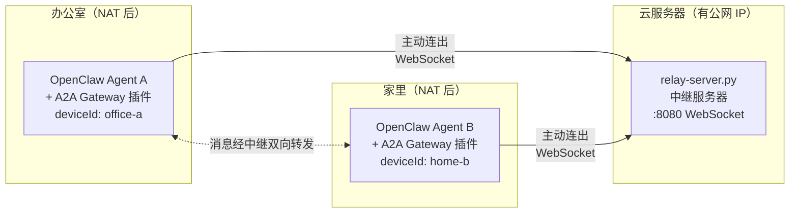
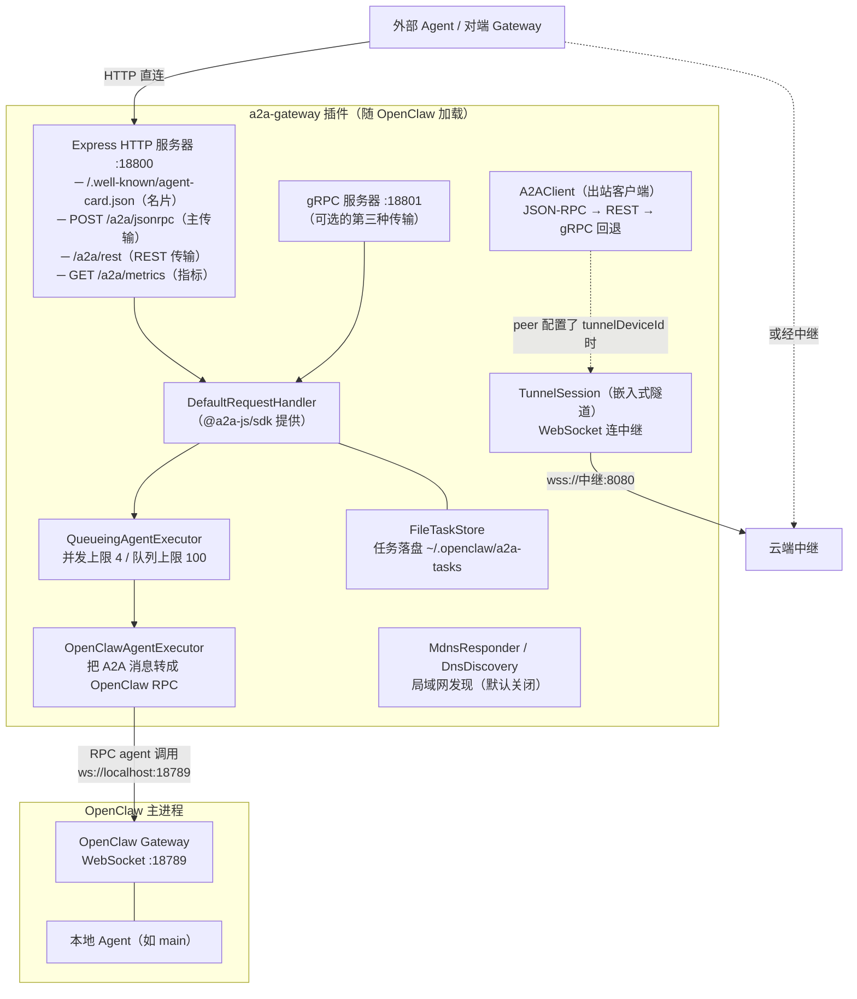
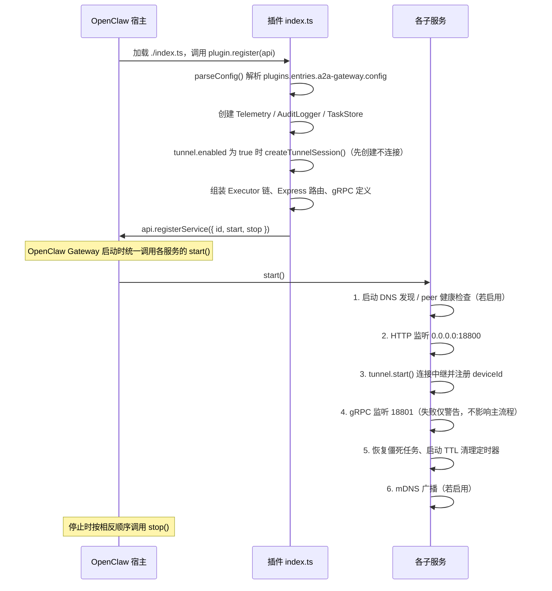
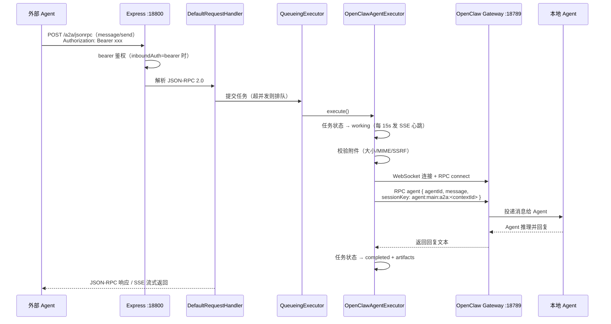
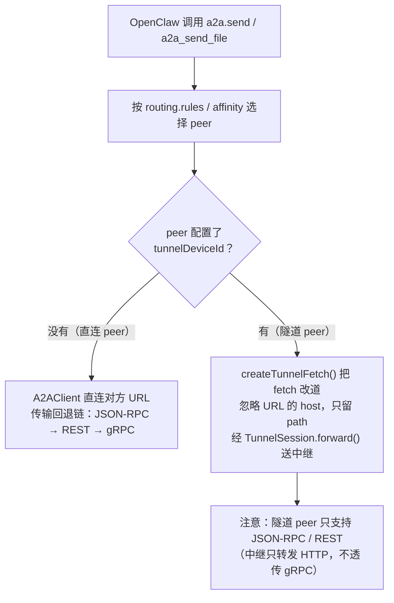
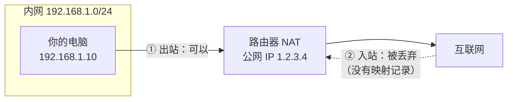
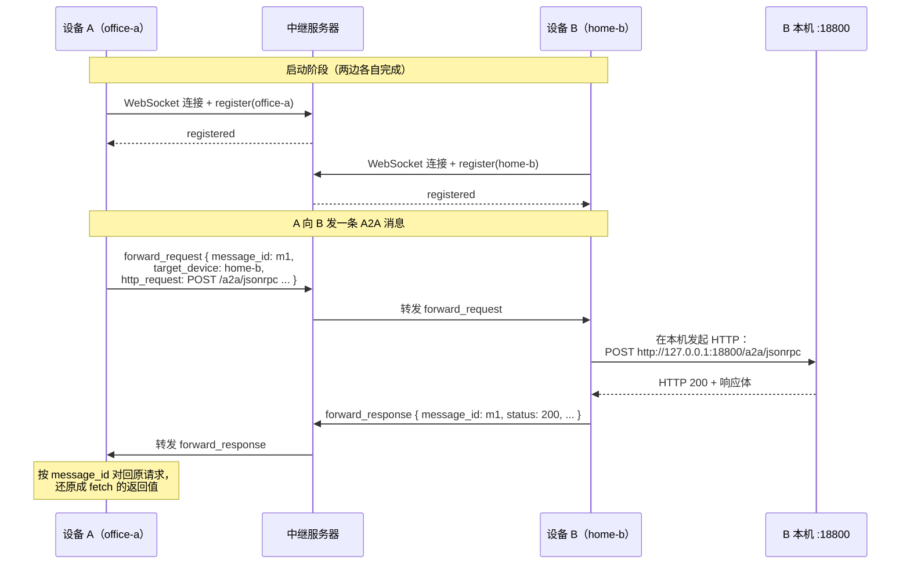
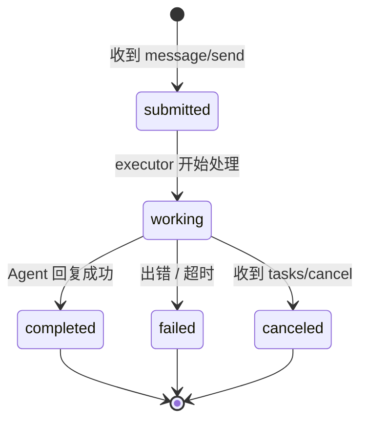
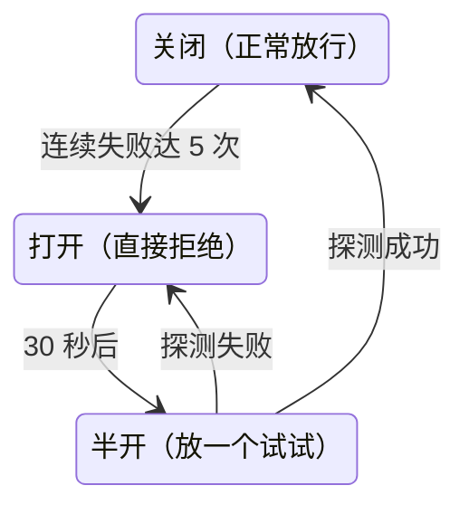

# OpenClaw A2A Gateway（嵌入 Tunnel 版）— 项目详解与操作手册

> 适用版本：`1.4.0-tunnel.1`
> 本文档分为三大部分：**第一部分讲清楚这个项目是什么、怎么运行的**；**第二部分深入讲解涉及的技术原理与知识点**；**第三部分是完整的操作手册**。
> 图表使用 Mermaid 绘制，在支持 Mermaid 的 Markdown 查看器（如 VS Code / Cursor / GitHub）中可直接渲染。

---

## 目录

- [第一部分：这个项目是什么、怎么运行的](#第一部分这个项目是什么怎么运行的)
  - [1.1 一句话概括](#11-一句话概括)
  - [1.2 它解决什么问题](#12-它解决什么问题)
  - [1.3 整体架构图](#13-整体架构图)
  - [1.4 目录结构导览](#14-目录结构导览)
  - [1.5 项目是如何被启动的（插件生命周期）](#15-项目是如何被启动的插件生命周期)
  - [1.6 一条消息的完整旅程（数据流）](#16-一条消息的完整旅程数据流)
- [第二部分：技术原理与知识点讲解](#第二部分技术原理与知识点讲解)
  - [2.1 A2A 协议（Agent-to-Agent）](#21-a2a-协议agent-to-agent)
  - [2.2 Agent Card：Agent 的"名片"](#22-agent-cardagent-的名片)
  - [2.3 JSON-RPC 2.0](#23-json-rpc-20)
  - [2.4 NAT 与内网穿透原理](#24-nat-与内网穿透原理)
  - [2.5 WebSocket 隧道协议详解](#25-websocket-隧道协议详解)
  - [2.6 mDNS / DNS-SD：局域网自动发现](#26-mdns--dns-sd局域网自动发现)
  - [2.7 任务（Task）生命周期与持久化](#27-任务task生命周期与持久化)
  - [2.8 弹性设计：健康检查、重试、熔断](#28-弹性设计健康检查重试熔断)
  - [2.9 安全机制](#29-安全机制)
  - [2.10 主要依赖一览](#210-主要依赖一览)
- [第三部分：操作手册](#第三部分操作手册)
  - [3.0 选择你的路线](#30-选择你的路线)
  - [3.1 环境准备](#31-环境准备)
  - [3.2 安装插件](#32-安装插件)
  - [3.3 修改插件配置的方法](#33-修改插件配置的方法)
  - [3.4 场景一：直连模式（两台机器网络互通）](#34-场景一直连模式两台机器网络互通)
  - [3.5 场景二：跨 NAT 隧道模式](#35-场景二跨-nat-隧道模式)
  - [3.6 从旧版双进程方案迁移](#36-从旧版双进程方案迁移)
  - [3.7 卸载插件](#37-卸载插件)
  - [3.8 配置字段完整参考](#38-配置字段完整参考)
  - [3.9 验收清单](#39-验收清单)
  - [3.10 常见问题排查](#310-常见问题排查)
- [附录：端口速查表](#附录端口速查表)

---

# 第一部分：这个项目是什么、怎么运行的

## 1.1 一句话概括

**本项目是一个 OpenClaw 插件，它让不同电脑上的 OpenClaw AI Agent 能够通过标准的 A2A（Agent-to-Agent）协议互相对话；并且内嵌了一个"隧道客户端"，即使两台电脑都藏在家庭/公司路由器（NAT）后面、没有公网 IP，也能借助一台云端中继服务器互通。**

它是上游 `openclaw-a2a-gateway` 的 fork 版本，核心改动是把原本需要单独运行的 `tunnel-client` 进程**嵌入到了插件内部**，跨 NAT 场景下少跑一个进程。

## 1.2 它解决什么问题

想象这样一个场景：

- 你在**办公室**的电脑上跑了一个 OpenClaw Agent（会写代码）；
- 你在**家里**的电脑上也跑了一个 OpenClaw Agent（管理你的日程）；
- 你希望这两个 Agent 能互相发消息、互相调用对方的能力。

有两个拦路虎：

1. **协议问题**：两个 Agent 怎么"说同一种语言"？—— 用 **A2A 协议**（Google 主导的开放标准，本项目实现 v0.3.0）解决。
2. **网络问题**：两台电脑都在路由器后面，没有公网 IP，根本连不上对方 —— 用 **WebSocket 隧道 + 云端中继**解决。



关键思路：**两台内网机器虽然"进不来"，但都"出得去"**。让它们各自主动连到公网中继并保持长连接，中继就能替它们互相转发消息了。

## 1.3 整体架构图

插件运行起来后，进程内部的组件关系如下：



各组件职责一句话总结：

| 组件 | 文件 | 职责 |
|------|------|------|
| Express HTTP 服务器 | `index.ts` | 对外暴露 A2A 端点，默认监听 `0.0.0.0:18800` |
| `buildAgentCard` | `src/agent-card.ts` | 生成本机 Agent 的"名片"（能力声明） |
| `DefaultRequestHandler` | `@a2a-js/sdk` | 解析 A2A 协议消息（JSON-RPC/REST/gRPC 共用） |
| `QueueingAgentExecutor` | `src/queueing-executor.ts` | 并发控制与排队 |
| `OpenClawAgentExecutor` | `src/executor.ts` | 真正干活：把 A2A 消息投递给本地 OpenClaw Agent |
| `FileTaskStore` | `src/task-store.ts` | 任务状态持久化到磁盘（重启不丢） |
| `A2AClient` | `src/client.ts` | 出站：向其他 peer 发消息 |
| `TunnelSession` | `src/tunnel/session.ts` | 嵌入式隧道，NAT 穿透 |
| `MdnsResponder` / `DnsDiscoveryManager` | `src/dns-responder.ts` / `src/dns-discovery.ts` | 局域网内自动广播/发现其他网关 |

## 1.4 目录结构导览

```text
Openclaw-A2A/
├── index.ts                    # ★ 插件入口：解析配置、注册路由、启停服务
├── openclaw.plugin.json        # 插件元数据 + 配置 JSON Schema + 默认配置
├── package.json                # 依赖与脚本；"openclaw".extensions 声明入口
├── README.md                   # 上游自带的中文操作手册
├── docs/
│   ├── COMPATIBILITY.md        # A2A 0.3.0 兼容性矩阵
│   └── 工作文档/
│       └── 2026-07-28-操作手册-项目详解.md    # 本文档
├── scripts/
│   └── tunnel-smoke.ts         # 隧道冒烟测试（本地起迷你中继自测，输出 SMOKE OK）
├── src/
│   ├── types.ts                # 全部配置类型：GatewayConfig / PeerConfig / TunnelConfig
│   ├── agent-card.ts           # 生成 Agent Card
│   ├── executor.ts             # ★ 入站核心：A2A → OpenClaw Gateway RPC
│   ├── queueing-executor.ts    # 并发/队列包装器
│   ├── client.ts               # ★ 出站核心：A2AClient（含隧道路径）
│   ├── task-store.ts           # 任务落盘存储
│   ├── task-cleanup.ts         # 过期任务清理（默认 72 小时 TTL）
│   ├── task-recovery.ts        # 重启后恢复"僵死"任务
│   ├── peer-health.ts          # peer 健康检查 + 熔断器
│   ├── peer-retry.ts           # 指数退避重试
│   ├── routing-rules.ts        # 消息路由规则
│   ├── dns-discovery.ts        # DNS-SD 服务发现（查询方）
│   ├── dns-responder.ts        # mDNS 广播（应答方，用 multicast-dns）
│   ├── quorum-discovery.ts     # 自适应发现轮询频率
│   ├── push-notifications.ts   # 长任务 webhook 推送
│   ├── file-security.ts        # 文件安全校验（大小/MIME/SSRF）
│   ├── telemetry.ts / audit.ts # 指标与审计日志
│   ├── tunnel/                 # ★ 嵌入式隧道客户端
│   │   ├── protocol.ts         #    消息类型定义、HTTP 头过滤
│   │   ├── session.ts          #    TunnelSession：注册/心跳/转发/重连
│   │   └── tunnel-fetch.ts     #    把 fetch 调用改道走隧道
│   └── internal/               # OpenClaw 网关间私有扩展（非标准 A2A）
├── tests/                      # 20+ 个单元/集成测试文件
├── cli/                        # 独立调试 CLI（@openclaw/a2a-cli，不随插件加载）
└── skill/                      # OpenClaw Skill：让 Agent 自己会装配这个插件
```

标 ★ 的四个文件是理解本项目的关键：`index.ts`（装配）、`src/executor.ts`（入站）、`src/client.ts`（出站）、`src/tunnel/session.ts`（穿透）。

## 1.5 项目是如何被启动的（插件生命周期）

本项目**不是独立程序**，没有自己的 `main` 函数，而是作为 OpenClaw 的插件被宿主加载。加载依据是 `package.json` 里的声明：

```json
"openclaw": {
  "extensions": ["./index.ts"]
}
```

启动全流程如下：



`register()` 阶段还会向 OpenClaw 注册若干**网关方法**（供控制面/Agent 调用）：

- `a2a.send` —— 向指定 peer 发送 A2A 消息
- `a2a.send_local_file` —— 读本地绝对路径，编码为内联 FilePart 后发送（避免 CLI ARG_MAX / E2BIG）
- `a2a.metrics` —— 读取运行指标
- `a2a.audit` —— 读取审计日志
- 以及推送通知相关方法；Agent 工具：`a2a_send_file`（公网 URI）、`a2a_send_local_file`（本地路径）

## 1.6 一条消息的完整旅程（数据流）

### 入站：外部 Agent → 本地 OpenClaw Agent（直连）



几个值得注意的细节：

- **多轮会话**：`sessionKey` 由 `contextId` 派生（`agent:${agentId}:a2a:${contextId}`），同一个 A2A 对话上下文会复用同一个 OpenClaw 会话，Agent 因此"记得"之前聊过什么。
- **兜底**：如果 RPC `agent` 调用失败，executor 会退而求其次调 `POST /hooks/wake` 唤醒 Agent。
- **超时**：等待 Agent 回复默认最长 5 分钟（`agentResponseTimeoutMs = 300000`）。

### 入站：外部 Agent → 本地（经隧道）

与直连相比只是"最前面一段"不同：请求先以 `forward_request` 消息经中继送达本机的 `TunnelSession`，由它在本机发起 `http://127.0.0.1:18800/...` 请求，之后流程与直连完全一致，最后响应再打包成 `forward_response` 原路返回。

### 出站：本地 → 外部 peer



---

# 第二部分：技术原理与知识点讲解

这一部分逐个讲解项目涉及的核心技术。每节先讲通用概念，再讲本项目的具体实现。

## 2.1 A2A 协议（Agent-to-Agent）

**是什么**：A2A 是一个开放协议标准，定义了"AI Agent 之间如何互相发现、互相发消息、互相委托任务"。就像 HTTP 定义了浏览器和服务器怎么通信，A2A 定义了 Agent 和 Agent 怎么通信。本项目通过 `@a2a-js/sdk` 实现 **A2A v0.3.0**。

**核心概念**：

| 概念 | 说明 |
|------|------|
| **Agent Card** | Agent 的自我描述文件（名字、能力、接口地址、鉴权方式），放在众所周知的 URL 上供发现 |
| **Message** | 一条消息，由多个 **Part** 组成（TextPart 文本 / FilePart 文件 / DataPart 结构化数据） |
| **Task** | 一次任务。发消息可能触发长时间运行的任务，任务有状态机：`submitted → working → completed / failed / canceled` |
| **contextId** | 对话上下文 ID，多条消息共享同一个 contextId 即构成多轮对话 |
| **Streaming** | 通过 SSE（Server-Sent Events）流式推送任务状态更新，客户端不用轮询 |

**多种传输方式**：A2A 允许同一个 Agent 通过多种传输协议提供服务。本项目同时开了三个口：

1. **JSON-RPC 2.0 over HTTP**（主传输，`POST /a2a/jsonrpc`）
2. **REST**（`/a2a/rest`）
3. **gRPC**（HTTP 端口 + 1，默认 18801）

出站时 `A2AClient` 按 JSON-RPC → REST → gRPC 顺序回退，某种传输失败自动换下一种。

## 2.2 Agent Card：Agent 的"名片"

**是什么**：一个 JSON 文件，放在约定路径 `/.well-known/agent-card.json`（本项目同时兼容旧路径 `/.well-known/agent.json`）。任何人 GET 这个 URL 就知道这个 Agent 叫什么、会什么、怎么联系。

`/.well-known/` 是 IETF RFC 8615 定义的"众所周知的 URI"机制——把元数据放在标准化路径下，客户端无需额外配置即可发现（HTTPS 证书验证的 ACME、安全策略的 `security.txt` 都用这个机制）。

本项目由 `buildAgentCard()`（`src/agent-card.ts`）生成，关键字段：

```json
{
  "protocolVersion": "0.3.0",
  "name": "OpenClaw A2A Gateway",
  "url": "http://localhost:18800/a2a/jsonrpc",
  "additionalInterfaces": [
    { "transport": "JSONRPC", "url": ".../a2a/jsonrpc" },
    { "transport": "HTTP+JSON", "url": ".../a2a/rest" },
    { "transport": "GRPC", "url": "host:18801" }
  ],
  "capabilities": { "streaming": true, "pushNotifications": false },
  "skills": [{ "id": "chat", "name": "chat", "description": "..." }]
}
```

对端拿到 Card 后，就知道用哪个 URL、哪种传输、什么鉴权方式来发消息。

## 2.3 JSON-RPC 2.0

**是什么**：一种极简的远程过程调用协议，用 JSON 描述"调用哪个方法、传什么参数、返回什么结果"。请求与响应格式：

```json
// 请求
{ "jsonrpc": "2.0", "id": 1, "method": "message/send",
  "params": { "message": { "role": "user", "parts": [{ "kind": "text", "text": "你好" }] } } }

// 成功响应
{ "jsonrpc": "2.0", "id": 1, "result": { "kind": "task", "status": { "state": "completed" } } }

// 错误响应
{ "jsonrpc": "2.0", "id": 1, "error": { "code": -32000, "message": "Unauthorized" } }
```

要点：

- `id` 用于把响应对上请求（HTTP 场景一问一答，`id` 意义不大；但在 WebSocket 等多路复用场景必不可少）。
- 错误码有约定区间：`-32700`（解析错误）、`-32600`（无效请求）、`-32601`（方法不存在）；`-32000` 起是服务端自定义错误。本项目鉴权失败即返回 `-32000 Unauthorized`。
- A2A 在 JSON-RPC 之上定义了标准方法名：`message/send`、`message/stream`、`tasks/get`、`tasks/cancel` 等。

## 2.4 NAT 与内网穿透原理

**NAT 是什么**：家庭/公司路由器做的"网络地址转换"。内网设备（192.168.x.x）共享路由器的一个公网 IP 上网。副作用是：**内网设备可以主动连出去，但外面的连接进不来**——路由器不知道该把陌生的入站连接交给哪台内网设备。



**穿透思路有哪些**（知识扩展）：

| 方案 | 原理 | 代表 |
|------|------|------|
| 端口映射 | 手动在路由器上配置"公网端口 → 内网 IP:端口" | 传统做法，需要路由器权限 |
| 打洞（Hole Punching） | 双方同时向对方发包，利用 NAT 的映射表"骗"出一条直连通道 | STUN、WebRTC、Tailscale |
| **中继（Relay）** | 双方都主动连一台公网服务器，由它转发全部流量 | TURN、frp、**本项目** |

本项目选择**纯中继方案**，因为它最简单、最可靠（打洞在对称型 NAT 下会失败，中继永远能通），代价是所有流量都经过中继服务器。

**本项目的实现**：两端的 `TunnelSession` 各自向中继发起一条 **出站 WebSocket 长连接**并保持心跳。由于连接是"从里往外"建立的，NAT 完全不阻拦；连接建好后是全双工的，中继随时可以顺着这条已有连接把数据"推回来"——这就绕过了"入站进不来"的限制。

## 2.5 WebSocket 隧道协议详解

**WebSocket 是什么**：在一次 HTTP 握手后升级成的**全双工长连接**协议。与普通 HTTP"一问一答"不同，WebSocket 建立后双方可随时互发消息，非常适合做隧道的承载层。

本项目隧道协议（`src/tunnel/protocol.ts`）非常简洁，全部消息是 JSON 文本，共 6 种类型：

| 消息类型 | 方向 | 作用 |
|----------|------|------|
| `register` | 客户端 → 中继 | 上报自己的 `device_id`，在中继"登记入住" |
| `registered` | 中继 → 客户端 | 登记成功确认（客户端等 10 秒，超时报错） |
| `forward_request` | 双向 | 携带一个完整 HTTP 请求（方法/路径/头/体），请中继转给 `target_device` |
| `forward_response` | 双向 | 携带 HTTP 响应（状态码/头/体），按 `message_id` 对回原请求 |
| `ping` / `pong` | 双向 | 心跳，默认每 15 秒一次，保住 NAT 映射与连接活性 |
| `error` | 中继 → 客户端 | 出错通知（最常见：`Device not found`，目标设备没在线） |

一次跨 NAT 请求的完整时序：



**`message_id` 的作用**：WebSocket 上多个请求并发跑，响应到达顺序不确定，必须靠唯一 ID 把响应和请求配对——这是所有多路复用协议的通用模式（HTTP/2 的 stream id、JSON-RPC 的 id 同理）。

**`createTunnelFetch` 的巧妙之处**（`src/tunnel/tunnel-fetch.ts`）：它返回一个与标准 `fetch` 签名完全相同的函数，但内部把请求打包成 `forward_request` 走隧道。这样 `A2AClient` 完全不需要知道隧道的存在——只是换了个 `fetch` 实现。URL 中的 host 部分会被忽略（真正的路由靠 `tunnelDeviceId`），只保留 path 和 query。这就是配置里隧道 peer 的 `agentCardUrl` 可以随便写 `http://127.0.0.1:18800/...` 的原因。

**断线重连**：中继或网络抖动导致连接断开时，`TunnelSession` 按 `reconnectIntervalMs`（默认 5 秒）间隔自动重连，最多 `maxReconnectAttempts`（默认 10）次。

**与旧版独立 tunnel-client 的区别**：旧版是独立进程，在本地开一个代理端口（如 18801），业务把请求发到该端口再被转发；嵌入版没有本地代理端口，出站直接在进程内调 `forward()`，少一跳、少一个进程。

## 2.6 mDNS / DNS-SD：局域网自动发现

**是什么**：mDNS（multicast DNS，RFC 6762）让局域网设备**不需要 DNS 服务器**就能互相解析名字——把 DNS 查询用 UDP 组播（224.0.0.251:5353）喊出去，是谁谁应答。DNS-SD（DNS Service Discovery，RFC 6763）在其上定义了"服务发现"的记录格式（PTR + SRV + TXT）。苹果的 AirDrop/AirPlay、打印机自动发现用的就是这套。

本项目的用法（**默认全部关闭**，属可选能力）：

| 模块 | 使用的库 | 角色 |
|------|----------|------|
| `MdnsResponder`（`src/dns-responder.ts`） | `multicast-dns` | **广播方**：把本机网关以 `_a2a._tcp.local` 服务类型广播出去，TXT 记录里带名字、协议、路径、鉴权信息 |
| `DnsDiscoveryManager`（`src/dns-discovery.ts`） | Node 内置 `dns.promises` | **查询方**：定期查询 SRV+TXT 记录，把发现的网关自动并入 peer 列表（与静态配置的 peers 合并，静态同名优先） |

还有一个 `QuorumDiscoveryManager` 做自适应轮询：周围 peer 稀少时高频探索（10 秒一次），peer 稳定后降到低频（120 秒一次），减少无谓的网络开销。

**注意**：mDNS 只在同一广播域（同一局域网）有效，跨路由器/跨 NAT 无效——跨网仍要靠隧道。

## 2.7 任务（Task）生命周期与持久化

A2A 的消息可能触发长任务（Agent 推理可能要几分钟），所以任务状态需要被跟踪和持久化：



本项目围绕任务做了三层保障：

1. **落盘持久化**（`FileTaskStore`）：任务写入 `~/.openclaw/a2a-tasks` 目录，进程重启不丢任务；客户端随时可用 `tasks/get` 查询状态。
2. **僵死恢复**（`task-recovery.ts`）：插件重启时扫描存储，把上次异常退出留下的、卡在 `working` 状态的任务标记为失败，避免客户端永远等待。
3. **TTL 清理**（`task-cleanup.ts`）：默认每 60 分钟清理一次超过 72 小时的旧任务，防止磁盘无限增长。

处理中的任务每 15 秒通过 SSE 发一次心跳状态，告诉客户端"还活着，别断开"。

## 2.8 弹性设计：健康检查、重试、熔断

分布式系统里对端随时可能挂掉，本项目实现了经典的三件套（`src/peer-health.ts`、`src/peer-retry.ts`）：

**健康检查**：默认每 30 秒探测一次每个 peer（超时 5 秒），维护 peer 的可用状态。

**指数退避重试**：请求失败后重试，间隔按 1s → 2s → 4s 指数增长（封顶 10s），最多 3 次。指数退避的意义：对方如果是过载了，密集重试只会雪上加霜；逐渐拉长间隔给对方喘息时间。

**熔断器（Circuit Breaker）**：连续失败 5 次后"跳闸"，直接拒绝后续请求（快速失败，不再浪费时间等超时）；30 秒后进入"半开"状态放一个探测请求，成功则恢复，失败则继续熔断。



## 2.9 安全机制

| 机制 | 实现 | 说明 |
|------|------|------|
| 入站鉴权 | `security.inboundAuth: "bearer"` + `security.token` | 请求必须带 `Authorization: Bearer <token>`，否则返回 JSON-RPC `-32000 Unauthorized`。默认 `none`（不鉴权），**对公网开放时务必打开** |
| 出站鉴权 | `peers[].auth.token` | 访问对方时带的 token，必须等于对方的 `security.token` |
| 文件大小限制 | `maxFileSizeBytes` 50MB / `maxInlineFileSizeBytes` 50MB | 防止超大附件打爆内存/磁盘；本地路径发送与内联 FilePart 共用 inline 上限 |
| MIME 白名单 | `allowedMimeTypes` | 只接受图片/PDF/文本/JSON/音视频/Office 等已知类型 |
| SSRF 防护 | `src/file-security.ts` | FilePart 允许"给个 URL 让服务端去下载"，必须校验 URL 不指向内网地址（如 `http://127.0.0.1/...`、云主机元数据接口 `169.254.169.254`），否则攻击者可借服务器之手探测内网——这就是 SSRF（服务端请求伪造）攻击 |
| 指标端点鉴权 | `observability.metricsAuth` | `/a2a/metrics` 可选 bearer 保护 |
| 审计日志 | `~/.openclaw/a2a-audit.jsonl` | 每条进出消息追加一行 JSON（JSONL 格式），可追溯 |
| 传输加密 | 中继用 `wss://`（TLS） | 生产环境务必用 wss，明文 ws 只用于内网测试 |

## 2.10 主要依赖一览

| 依赖 | 用途 |
|------|------|
| `@a2a-js/sdk` | A2A v0.3.0 官方 SDK：Agent Card 类型、请求处理器、JSON-RPC/REST/gRPC 处理器、出站客户端工厂 |
| `express` | HTTP 服务器框架，承载所有 HTTP 端点 |
| `ws` | WebSocket 库：① 隧道客户端连中继；② executor 连本地 OpenClaw Gateway；③ 测试里起迷你中继 |
| `@grpc/grpc-js` + `@bufbuild/protobuf` | 入站 gRPC 服务（18801 端口）与出站 gRPC 传输 |
| `multicast-dns` | mDNS 组播广播（局域网发现的应答方） |
| `uuid` | 生成 messageId / taskId 等唯一标识 |
| `tsx` | 直接运行 TypeScript（测试与冒烟脚本），无需先编译 |
| `openclaw`（devDependency） | 仅提供 `OpenClawPluginApi` 类型定义，运行时由宿主注入，无硬依赖 |

---

# 第三部分：操作手册

## 3.0 选择你的路线

| 你的情况 | 需要做的章节 |
|----------|--------------|
| 第一次接触，先确认代码能跑 | 3.1 → 3.2 |
| 两台机器同局域网 / Tailscale，能互 ping | 3.1 → 3.2 → 3.3 → 3.4 |
| 两台机器都在 NAT 后，无法直连 | 3.1 → 3.2 → 3.3 → 3.5 |
| 以前用独立 tunnel-client，要迁移 | 3.6 |
| 卸载 | 3.7 |

每一步都遵循同一格式：**做什么 → 敲什么命令 → 看到什么算成功 → 失败怎么办**。

## 3.1 环境准备

### 步骤 1 — 检查 Node.js 与 npm

```bash
node -v    # 需要 v22 或更高
npm -v     # 有版本号即可
```

失败：安装 [Node.js 22+](https://nodejs.org/)，装完重开终端。

### 步骤 2 — 检查 OpenClaw

```bash
openclaw --version
openclaw gateway status    # 确认 Gateway 能启动；没运行就 openclaw gateway start
```

### 步骤 3 — 确认插件目录

```powershell
# Windows PowerShell
dir D:\openclaw\Openclaw-A2A
```

能看到 `package.json`、`index.ts`、`src` 即正确。注意本手册针对 **tunnel 集成版**。

### 步骤 4 —（仅 NAT 隧道模式需要）检查 Python

```bash
python --version    # 需要 3.7+，用于运行中继服务器
```

## 3.2 安装插件

在**每一台**要跑 A2A 的电脑上执行。

### 步骤 1 — 安装依赖

```bash
cd D:\openclaw\Openclaw-A2A
npm install
```

成功：无红色报错，出现 `node_modules`。
失败：网络问题配 npm 镜像；Node 版本升到 22+；不要用 `--production`（测试需要 tsx）。

### 步骤 2 — 先本地自测（强烈建议）

```bash
npm run test:tunnel     # 隧道集成测试，应全部 pass
npm run smoke:tunnel    # 冒烟测试，最后一行应输出 SMOKE OK
```

冒烟脚本会在本地起一个迷你中继（:18181）和两个假服务（:18191/18192），完整走一遍"注册 → 转发 → 响应"流程，不依赖 OpenClaw 和外网。**这里失败就先别装插件**，把报错解决了再继续。

### 步骤 3 — 清理旧版本（如果装过）

```bash
openclaw plugins list
# 若列表里已有 a2a-gateway：
openclaw plugins uninstall a2a-gateway
```

### 步骤 4 — 安装并启用

```bash
openclaw plugins install D:\openclaw\Openclaw-A2A
openclaw config set plugins.allow '["a2a-gateway"]'
openclaw config set plugins.entries.a2a-gateway.enabled true
openclaw gateway restart
```

注意：

- 插件 ID 是 `a2a-gateway`（不是文件夹名）。
- 若 allow 列表里还有其他插件，写在同一个数组里：`'["telegram","a2a-gateway"]'`。
- 部分环境需要显式指定加载路径（Windows 下 JSON 里反斜杠写成 `\\`）：

```bash
openclaw config set plugins.load.paths '["D:\\openclaw\\Openclaw-A2A"]'
```

### 步骤 5 — 验证

```bash
openclaw plugins list          # 应看到 a2a-gateway 且为 enabled
curl -s http://127.0.0.1:18800/.well-known/agent-card.json
```

成功：curl 返回一段含 `name`、`protocolVersion` 的 JSON。
失败（连接拒绝）：① 再 `openclaw gateway restart`；② 查日志有无 `a2a-gateway: HTTP listening`；③ 查 18800 是否被占用；④ 确认 `enabled: true`。

## 3.3 修改插件配置的方法

插件的全部配置挂在 OpenClaw 配置树的这个位置：

```text
plugins.entries.a2a-gateway.config
```

**推荐做法（对新手最稳妥）**：直接编辑 OpenClaw 的配置文件（常见位置 `~/.openclaw/config.json` 或类似，以你的安装为准），找到如下结构，把后面章节给出的 JSON 填进 `config` 里：

```json
{
  "plugins": {
    "entries": {
      "a2a-gateway": {
        "enabled": true,
        "config": {
          // ← 配置填这里
        }
      }
    }
  }
}
```

注意：JSON 不能有注释、字符串必须双引号；**改完必须 `openclaw gateway restart` 才生效**。

查看当前配置：

```bash
openclaw config get plugins.entries.a2a-gateway
```

## 3.4 场景一：直连模式（两台机器网络互通）

适用：同局域网、Tailscale、或双方有公网 IP。**不要写 `tunnel` 字段，不要写 `tunnelDeviceId`。**

假设电脑 A 是 `192.168.1.10`，电脑 B 是 `192.168.1.20`（用 `ipconfig` / `ip addr` 查你的真实 IP）。

### 电脑 A 的配置

```json
{
  "server": { "host": "0.0.0.0", "port": 18800 },
  "agentCard": {
    "name": "电脑A-Gateway",
    "url": "http://192.168.1.10:18800",
    "skills": ["chat"]
  },
  "peers": [
    {
      "name": "电脑B",
      "agentCardUrl": "http://192.168.1.20:18800/.well-known/agent-card.json",
      "auth": { "type": "bearer", "token": "token-for-B" }
    }
  ],
  "security": { "inboundAuth": "bearer", "token": "token-for-A" }
}
```

### 电脑 B 的配置

镜像对调：`agentCard.url` 写 B 自己的 IP；peer 指向 A（`token-for-A`）；`security.token` 为 `token-for-B`。

### 令牌规则（最容易搞错的地方）

- `security.token` = **别人访问我**时要出示的令牌。
- peer 里的 `auth.token` = **我访问对方**时出示的令牌，**必须等于对方的 `security.token`**。

| | 电脑 A | 电脑 B |
|--|--------|--------|
| 本机入站 token（security.token） | `token-for-A` | `token-for-B` |
| 访问对方时带的 token（peer.auth.token） | `token-for-B` | `token-for-A` |

### 验证

两台都 `openclaw gateway restart`，然后在 A 上：

```bash
curl -s -H "Authorization: Bearer token-for-B" http://192.168.1.20:18800/.well-known/agent-card.json
```

成功返回 JSON 后，在 OpenClaw 里用 `a2a.send` 向 peer 名 `电脑B` 发一条消息做业务验证。
失败：优先查防火墙是否放行 18800、IP 是否写错、对方 Gateway 是否在跑、401 就重对令牌。

## 3.5 场景二：跨 NAT 隧道模式

分两步：先在云服务器部署中继（只做一次），再在两台业务机器上激活隧道。

### 3.5.1 部署云端中继

中继需要跑在一台**两边都能访问到**的机器上（云主机最合适）。中继代码在独立目录（如 `D:\openclaw\a2a-relay-2`）。

```bash
cd /path/to/a2a-relay-2
pip install -r requirements.txt
python relay-server.py --host 0.0.0.0 --port 8080 --http-port 8081
```

- `8080`：WebSocket 端口（插件要连的）
- `8081`：HTTP 管理端口（`/health` 健康检查、`/list` 在线设备列表）

保持进程常驻（建议用 systemd / pm2 / nssm 做成服务）。然后验证：

```bash
# 中继机器本机：
curl -s http://127.0.0.1:8081/health     # 应返回正常 JSON
curl -s http://127.0.0.1:8081/list       # 初始为空设备列表

# 在两台业务机器上分别执行（换成中继的真实公网 IP）：
curl -s http://中继公网IP:8081/health
```

业务机器访问不到：检查云厂商安全组 / 防火墙是否放行 **8080 和 8081**。

确定 `relayUrl` 的写法：

| 场景 | relayUrl |
|------|----------|
| 内网测试 | `ws://中继内网IP:8080` |
| 公网明文（仅测试） | `ws://中继公网IP:8080` |
| 生产（推荐） | `wss://你的域名`（Nginx 等做 TLS 反代到 8080） |

**必须以 `ws://` 或 `wss://` 开头**，写成 `http://` 会导致插件启动失败。

### 3.5.2 两台业务机器激活隧道

约定：设备 A 叫 `office-a`（入站令牌 `token-office-a`），设备 B 叫 `home-b`（入站令牌 `token-home-b`）。

**设备 A 的配置**（`plugins.entries.a2a-gateway.config`）：

```json
{
  "server": { "host": "127.0.0.1", "port": 18800 },
  "agentCard": { "name": "办公室 Gateway", "skills": ["chat"] },
  "tunnel": {
    "enabled": true,
    "relayUrl": "ws://中继公网IP:8080",
    "deviceId": "office-a"
  },
  "peers": [
    {
      "name": "home-b",
      "tunnelDeviceId": "home-b",
      "agentCardUrl": "http://127.0.0.1:18800/.well-known/agent-card.json",
      "auth": { "type": "bearer", "token": "token-home-b" }
    }
  ],
  "security": { "inboundAuth": "bearer", "token": "token-office-a" }
}
```

**设备 B 的配置**：镜像对调（`deviceId: "home-b"`，peer 指向 `office-a`，令牌互换）。

配置要点：

1. `tunnel.enabled` 必须是布尔 `true`（不是字符串 `"true"`）——这是隧道总开关。
2. `tunnel.deviceId` 是**本机**身份；peer 的 `tunnelDeviceId` 是**对方**的身份，别写反。
3. 两边 `relayUrl` 必须指向同一中继；两边 `deviceId` 不能相同。
4. 隧道模式下 `agentCardUrl` 的 host 随便写 `127.0.0.1` 即可——真正的路由靠 `tunnelDeviceId`（原理见 2.5 节）。
5. 隧道模式下 `server.host` 可以收紧为 `127.0.0.1`（不需要对外网卡监听，入站流量都从隧道本机转入）。

**核对表**（发消息前抄下来核对一遍）：

| 项目 | 设备 A | 设备 B |
|------|--------|--------|
| tunnel.deviceId | `office-a` | `home-b` |
| peer.tunnelDeviceId | `home-b` | `office-a` |
| 本机 security.token | `token-office-a` | `token-home-b` |
| peer.auth.token | `token-home-b` | `token-office-a` |

### 3.5.3 重启并验证

两台先后执行 `openclaw gateway restart`，然后逐项检查：

**① 看日志**，应出现：

```text
a2a-gateway: HTTP listening on 127.0.0.1:18800
a2a-tunnel: connected as office-a → ws://...
a2a-gateway: tunnel enabled deviceId=office-a relay=ws://...
```

没有这些日志：① 配置是否保存成功；② `enabled` 是否真是布尔 true；③ `relayUrl` 前缀是否 ws/wss；④ 中继是否在跑；⑤ 防火墙。

**② 查中继设备列表**（在中继机器上）：

```bash
curl -s http://127.0.0.1:8081/list
```

应同时看到 `office-a` 和 `home-b`。只有一台就去查缺席那台的日志。

**③ 业务互发**：A 上向 peer `home-b` 发 `a2a.send`，B 上向 `office-a` 回一条。双向成功即部署完成。

| 失败现象 | 优先检查 |
|----------|----------|
| 超时 | `/list` 里两台是否都在；对端 18800 是否监听；`tunnelDeviceId` 是否写反 |
| 401 | 按核对表重对令牌 |
| Device xxx not found | 对端未注册到中继，或 deviceId 拼写不一致 |

**④ 停掉旧的独立 tunnel-client**（如果以前用过）：不要再运行 `node client.js --local-port ...`，取消它的开机自启，peer URL 也不要再指向旧代理端口 18801。

### 3.5.4 混合模式（部分 peer 直连、部分走隧道）

同一份配置里可以混用——没写 `tunnelDeviceId` 的 peer 走直连（可用 gRPC），写了的走中继（仅 JSON-RPC/REST）：

```json
{
  "tunnel": { "enabled": true, "relayUrl": "ws://中继:8080", "deviceId": "office-a" },
  "peers": [
    { "name": "局域网设备", "agentCardUrl": "http://192.168.1.50:18800/.well-known/agent-card.json" },
    { "name": "home-b", "tunnelDeviceId": "home-b",
      "agentCardUrl": "http://127.0.0.1:18800/.well-known/agent-card.json",
      "auth": { "type": "bearer", "token": "token-home-b" } }
  ]
}
```

## 3.6 从旧版双进程方案迁移

旧方案命令行参数与新配置的对应关系：

| 旧 tunnel-client 参数 | 新插件配置 |
|-----------------------|-----------|
| `--remote-server` | `tunnel.relayUrl` |
| `--device-id` | `tunnel.deviceId` |
| `--target-device` | `peers[].tunnelDeviceId` |
| `--local-service-port` | 一般不用写（默认取 `server.port`） |
| `--local-port` | **删除**，嵌入版没有本地代理端口 |

迁移步骤：中继不用动（协议兼容）→ 先迁一台（按 3.2 + 3.5 配置并重启，确认日志和 `/list` 正常）→ 与仍在用旧客户端的对端互发验证 → 再迁另一台 → 最后停掉所有旧 `client.js` 进程。

## 3.7 卸载插件

```bash
openclaw plugins uninstall a2a-gateway --dry-run   # 先预览会删哪些配置
openclaw plugins uninstall a2a-gateway             # 正式卸载（--force 跳过确认）
openclaw gateway restart
openclaw plugins list                              # 确认列表里没有了
```

- 加 `--keep-files` 可以只清配置、保留磁盘文件。
- 卸载**不会删除**源码目录。
- 只想临时关闭：`openclaw plugins disable a2a-gateway` 后重启 Gateway。

## 3.8 配置字段完整参考

### server / agentCard

| 字段 | 默认 | 说明 |
|------|------|------|
| `server.host` | `0.0.0.0` | HTTP 监听地址；纯隧道模式可收紧为 `127.0.0.1` |
| `server.port` | `18800` | HTTP 端口；gRPC 自动用 port+1 |
| `agentCard.name` | `OpenClaw A2A Gateway` | 名片上的名字 |
| `agentCard.url` | `http://localhost:18800/a2a/jsonrpc` | 名片上公布的本机地址（直连模式写真实 IP） |
| `agentCard.skills` | `["chat"]` | 能力列表 |

### tunnel

| 字段 | 必填 | 默认 | 说明 |
|------|------|------|------|
| `enabled` | 否 | `false` | 隧道总开关 |
| `relayUrl` | enabled 时必填 | — | `ws://` 或 `wss://` 开头 |
| `deviceId` | enabled 时必填 | — | 本机在中继上的唯一身份 |
| `localServicePort` | 否 | `server.port` | 隧道入站流量转到本机哪个端口 |
| `heartbeatIntervalMs` | 否 | `15000` | 心跳间隔 |
| `requestTimeoutMs` | 否 | `300000` | 单次转发超时 |
| `reconnectIntervalMs` | 否 | `5000` | 断线重连间隔 |
| `maxReconnectAttempts` | 否 | `10` | 最大重连次数 |

### peers[]

| 字段 | 说明 |
|------|------|
| `name` | 逻辑名，`a2a.send` 时用它指定目标 |
| `agentCardUrl` | 对方名片地址；隧道模式下只有 path 有意义 |
| `tunnelDeviceId` | 写了就走中继，不写就直连 |
| `auth.type` / `auth.token` | 访问该 peer 的鉴权（bearer + 对方的 security.token） |

### security / 其他常用项

| 字段 | 默认 | 说明 |
|------|------|------|
| `security.inboundAuth` | `none` | 设为 `bearer` 开启入站鉴权 |
| `security.token` | — | 入站令牌 |
| `security.maxFileSizeBytes` | 52428800（50MB） | URI 附件上限 |
| `security.maxInlineFileSizeBytes` | 52428800（50MB） | 内联 base64 / `a2a.send_local_file` 上限 |
| `routing.defaultAgentId` | `main` | 入站消息默认交给哪个本地 Agent |
| `limits.maxConcurrentTasks` | `4` | 最大并发任务 |
| `limits.maxQueuedTasks` | `100` | 最大排队任务 |
| `timeouts.agentResponseTimeoutMs` | `300000` | 等 Agent 回复的超时（5 分钟） |
| `storage.taskTtlHours` | `72` | 任务保留时长 |
| `observability.metricsPath` | `/a2a/metrics` | 指标端点 |
| `discovery.enabled` / `advertise.enabled` | `false` | 局域网发现/广播开关 |

### 会直接导致启动失败的配置错误

| 错误写法 | 结果 |
|----------|------|
| `tunnel.enabled: true` 但缺 `relayUrl` 或 `deviceId` | 配置解析失败，插件起不来 |
| `relayUrl: "http://..."` | 解析失败（必须 ws/wss） |
| peer 写了 `tunnelDeviceId` 但 `tunnel.enabled` 不是 true | 启动抛错 |

## 3.9 验收清单

**安装与本地：**

- [ ] `node -v` ≥ 22；`npm install` 成功
- [ ] `npm run test:tunnel` 全部通过
- [ ] `npm run smoke:tunnel` 输出 `SMOKE OK`
- [ ] `openclaw plugins list` 可见 `a2a-gateway` 且 enabled
- [ ] `curl 127.0.0.1:18800/.well-known/agent-card.json` 返回 JSON

**直连模式（若使用）：**

- [ ] 两边 `IP:18800` 互相 curl 通
- [ ] 令牌按对照表互指
- [ ] `a2a.send` 双向成功

**NAT 隧道模式（若使用）：**

- [ ] 中继在跑，两边都能 `curl 中继:8081/health`
- [ ] 两边 `tunnel.enabled=true`、`relayUrl` 相同、`deviceId` 互不相同
- [ ] 日志出现 `a2a-tunnel: connected as ...`
- [ ] 中继 `/list` 同时列出两个 device
- [ ] `a2a.send` 双向成功
- [ ] 旧的独立 tunnel-client 已全部停掉

## 3.10 常见问题排查

| 现象 | 排查步骤 |
|------|----------|
| `plugins list` 里没有 a2a-gateway | ① install 是否成功 ② enabled 是否 true ③ 是否重启了 Gateway |
| curl 18800 被拒绝 | ① `gateway restart` ② 日志有无 `HTTP listening` ③ 端口是否被占用 |
| `test:tunnel` 报找不到 ws/tsx | 重新完整执行 `npm install`（不要 --production） |
| 启动报缺 relayUrl / deviceId | `tunnel.enabled=true` 时这两项必填；不用隧道就改回 false |
| 日志显示隧道连接超时 | ① 中继是否在听 8080 ② 云安全组 ③ relayUrl 的主机/端口/ws 前缀 |
| 中继 `/list` 没有本机 | 本机日志是否 connected；deviceId 是否被另一个连接挤占 |
| a2a.send 超时 | `/list` 两台是否都在；`tunnelDeviceId` 是否写反；对端 18800 是否监听 |
| 401 Unauthorized | 按 3.5.2 核对表重新对一遍令牌 |
| 想跨 NAT 用 gRPC | 不支持——中继只转发 HTTP，隧道 peer 只能 JSON-RPC/REST |
| `gateway call a2a.send` 报 `GatewayClientRequestError: unkown error` | CLI 会把插件返回的真实错误（如 `Peer not found`）吞掉只显示通用错误。① 最常见原因：`peer` 参数与配置里 `peers[].name` 不完全一致（注意不是 `tunnelDeviceId`）；② PowerShell 可能吞掉 JSON 引号，参数先存变量再传：`$p = '{"peer":"..."}'` |
| `gateway call` 报 `gateway timeout after 10000ms` | 不是发送失败。`a2a.send` 是阻塞调用，会等对端 Agent 推理完才返回，而 CLI 默认只等 10 秒。加 `--timeout 300000`（与插件内部 5 分钟超时对齐），或事后用审计确认结果 |
| 不确定消息到底发没发出去 | CLI 的报错不可全信，看两个权威判据：① `openclaw gateway call a2a.audit` 里有无 outbound 记录及其 `ok`/`statusCode`（完全没有记录 = 参数/peer 名问题，根本没进发送流程）；② 中继日志里有无 `HTTP: POST /a2a/jsonrpc` 及对应的 `forward_response status: 200` |

排查时的日志关键字：`a2a-tunnel:`、`a2a-gateway: tunnel`、`a2a-gateway: HTTP listening`。

**跨隧道业务验证的推荐流程**（无需 curl / 脚本，只用 CLI 和日志）：

1. 在一端执行 `openclaw gateway call a2a.send --timeout 300000 --params $p`（`$p` 里的 `peer` 用配置中的 `peers[].name`）。
2. 立刻看中继日志：出现 `POST /a2a/jsonrpc` 即发送成功。
3. `openclaw gateway call a2a.audit` 确认 outbound 记录 `ok: true`、statusCode 200。
4. 在对端 OpenClaw 里确认出现新会话（session key 形如 `agent:main:a2a:<contextId>`）。
5. 反向再发一条，双向成功即验收完成。

---

# 附录：端口速查表

| 端口 | 归属 | 用途 |
|------|------|------|
| **18800** | 本插件 | A2A HTTP（Agent Card / JSON-RPC / REST / metrics） |
| **18801** | 本插件 | A2A gRPC（HTTP 端口 + 1；启动失败仅警告） |
| **18789** | OpenClaw | OpenClaw Gateway WebSocket（executor 内部连它调 Agent） |
| **8080** | 中继服务器 | WebSocket（隧道客户端连接的口） |
| **8081** | 中继服务器 | HTTP 管理（`/health`、`/list`） |
| 18181 / 18191 / 18192 | 冒烟脚本 | 本地自测用的迷你中继和假服务 |

---

*本文档基于源码 `1.4.0-tunnel.1` 撰写。配置 Schema 的权威来源是 `openclaw.plugin.json`，运行时行为以 `index.ts` 的 `parseConfig()` 为准。*
