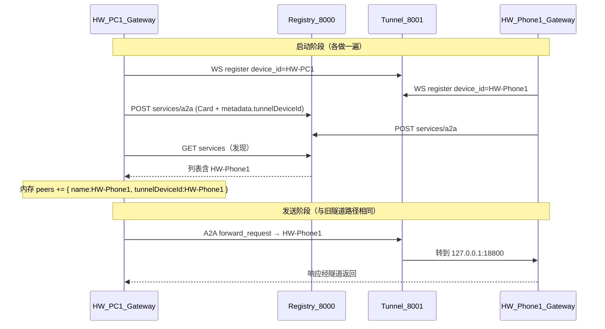

# 改动说明：注册中心远场 A2A（2026-07-30）

> **文档位置**：`docs/工作文档/2026-07-30-改动说明-注册中心远场A2A.md`  
> **操作手册入口**：根目录 [`README.md`](../../README.md) 第 5A 章  
> **验收结论**：[`2026-07-30-测试报告-注册中心远场A2A.md`](./2026-07-30-测试报告-注册中心远场A2A.md)  
> **参考备份**：[`2026-07-30-参考-注册中心README.md`](./2026-07-30-参考-注册中心README.md)  
> **插件版本**：`1.4.3-tunnel.1` → **`1.4.3-tunnel.2`**  
> **一句话**：注册中心当「通讯录」；远场管道仍是原来的隧道 `ws://…:8001` + `a2a.send`。

---

## 0. 先看懂：改了什么 / 没改什么

| | 说明 |
|--|------|
| **没改** | A2A 协议、隧道转发原理、`a2a.send` 工具本身 |
| **改了** | 对端 peer 可以「自动从注册中心发现」，不必两边手写对方 Card |
| **关系** | 注册中心 = 通讯录；隧道 = 打电话的线；A2A = 通话内容 |

```text
以前：配置里手写 peers → 隧道 → a2a.send
现在：可选「注册中心报到 + 查通讯录」自动填 peers → 隧道 → a2a.send（同一条发送路径）
```

手写 `peers` **仍然可用**。`registry.enabled` 默认 `false`，不配注册中心时行为与改造前一致。

---

## 1. 背景与目标

### 1.1 要解决什么

跨网（NAT）时，两端往往不能事先知道对方局域网 IP。旧做法是在 `openclaw.json` 里**写死**对端：

```json
"peers": [{
  "name": "HW-Phone1",
  "tunnelDeviceId": "HW-Phone1",
  "agentCardUrl": "http://127.0.0.1:18800/.well-known/agent-card.json",
  "auth": { "type": "bearer", "token": "12345678" }
}]
```

验收目标变成：

1. PC、Phone **各自向注册中心注册**（不必事先在对方配置写死对方 Card）  
2. **从中心发现**对端 `service_id`  
3. **跨网发出一条 A2A 文本**（`a2a.send`）并成功返回  

### 1.2 现网地址（2026-07-30）

| 组件 | 地址 | 作用 |
|------|------|------|
| 注册中心 | `http://121.37.53.35:8000` | 注册 / 发现 Agent Card（通讯录） |
| 隧道中继 | `ws://121.37.53.35:8001` | 远场 A2A 管道（与改造前相同） |
| Dataset | `openclaw_devices` | 本验收使用的命名空间 |

远场**不默认**走注册中心 HTTP `route=relay`（那要求中心能直连设备局域网，NAT 下通常不行）。选定路径是文档里的「端侧 WebSocket 隧道」。

---

## 2. 修改了哪些文件（清单）

### 2.1 【源码】新增

| 文件 | 作用 |
|------|------|
| **`src/registry-client.ts`** | 注册中心 HTTP 客户端：建 dataset、注册 Card、拉列表、周期发现、转成 `PeerConfig` |

### 2.2 【源码】修改

| 文件 | 改了什么 | 为什么 |
|------|----------|--------|
| **`src/types.ts`** | `GatewayConfig` 增加可选 `registry` | 让配置进入类型系统 |
| **`openclaw.plugin.json`** | schema 增加 `registry` 对象及 `uiHints` | OpenClaw 配置校验 / UI；否则 Phone 会报 `must NOT have additional properties` |
| **`index.ts`** | `parseConfig` 解析 registry；启动时注册+发现；`getEffectivePeers` 合并发现结果；隧道可带增强 REGISTER | 把通讯录接到现有 gateway 生命周期 |
| **`src/agent-card.ts`** | Card 写入 `metadata.tunnelDeviceId` | 中心/旧中继用该字段把服务绑到隧道设备 ID |
| **`src/tunnel/protocol.ts`** | `TunnelRegisterExtras` + `registerExtras` 选项 | 类型支持增强 REGISTER |
| **`src/tunnel/session.ts`** | REGISTER 可带 `dataset`/`service_id`/`agent_card`；拒识则回退仅 `device_id` | 兼容新旧中继 |
| **`package.json`** | version → `1.4.3-tunnel.2` | 版本标记 |

### 2.3 【文档 / 快照】

| 文件 | 作用 |
|------|------|
| `docs/工作文档/2026-07-30-参考-注册中心README.md` | 手机 `/data/local/注册中心-README.md` 备份 |
| `docs/工作文档/2026-07-30-测试报告-注册中心远场A2A.md` | 验收结论 |
| `docs/工作文档/2026-07-30-改动说明-注册中心远场A2A.md` | 本文 |
| `docs/device/workspace-snapshots/openclaw-json-relevant-excerpt.json` | 设备侧 registry 配置摘录 |
| 根 `README.md` | 增加第 5A 章操作步骤 |

### 2.4 【未改】

- `src/client.ts` 的隧道发送逻辑（发现出的 peer 仍走已有 `tunnelDeviceId` 分支）  
- SoftBus / mDNS 主路径  
- 注册中心服务端本身  

---

## 3. 每个文件具体怎么改、为什么

### 3.1 新建 `src/registry-client.ts`

**做什么：** 封装注册中心 HTTP API。

| 方法 | HTTP | 说明 |
|------|------|------|
| `ensureDataset()` | `POST /api/datasets` | 没有 `openclaw_devices` 就创建；已存在则忽略 |
| `registerA2a(card)` | `POST /api/datasets/{dataset}/services/a2a` | body：`service_id` + `agent_card` + `persistent` |
| `listServices()` | `GET .../services?fields=detail` | 拉全量服务 |
| `servicesToPeers()` | （本地） | 跳过自己；抽出 `tunnelDeviceId`；生成 `PeerConfig` |
| `start()` / `refresh()` | （定时） | 按 `discoverIntervalMs` 刷新内存中的 discovered peers |

**为什么要单独文件：** 注册中心是独立 HTTP 服务，与隧道 WS、A2A JSON-RPC 解耦；便于单测和以后换地址。

**重要兼容（实测踩坑）：** 中心 list 返回的是：

```json
{ "id": "HW-Phone1", "metadata": { /* 整份 Agent Card，内含 metadata.tunnelDeviceId */ } }
```

而不是文档示例里的 `service_id` + `agent_card`。因此解析必须同时认 `id` / `service_id` 和 `metadata` / `agent_card`。

### 3.2 `src/types.ts`

在 `GatewayConfig` 增加：

```ts
registry?: import("./registry-client.js").RegistryConfig;
```

`RegistryConfig` 字段：`enabled`、`baseUrl`、`dataset`、`serviceId`、`registerOnStart`、`discoverIntervalMs`、`mergeWithStatic`、`authToken?`、`defaultPeerAuth?`。

**为什么：** 与插件其它配置一样走类型，避免魔法字符串。

### 3.3 `openclaw.plugin.json`

在 `configSchema.properties` 增加完整 `registry` 对象 schema；`uiHints.registry` 标记敏感 token。

**为什么：** OpenClaw 用插件 schema 校验 `openclaw.json`。Phone 上若仍用旧 schema（例如 npm 自带的 `.../node_modules/openclaw/extensions/a2a-gateway/openclaw.plugin.json`），会出现：

```text
plugins.entries.a2a-gateway.config: invalid config: must NOT have additional properties
```

部署时必须把**新 schema**同步到实际参与校验的那份 `openclaw.plugin.json`。

### 3.4 `index.ts`（核心接线）

#### （1）`parseConfig` 增加 registry

- 读 `registry.*`  
- `serviceId` 默认用 `tunnel.deviceId`  
- `defaultPeerAuth`：显式配置优先；否则从静态 peers 里抄一份 auth 模板（发现-only 且 `peers: []` 时必须配 `defaultPeerAuth`，否则对端 bearer 过不去）

#### （2）创建 `RegistryClient`；隧道可选 `registerExtras`

gateway `register()` 时：

1. `buildAgentCard(config)`（已含 `metadata.tunnelDeviceId`）  
2. 若 `tunnel.enabled`：创建 `TunnelSession`；若同时 `registry.enabled`，把 `dataset/serviceId/agentCard` 作为 REGISTER 附加字段（中继拒识则 `session` 内回退纯 `device_id`）  
3. 若 `registry.enabled`：`new RegistryClient(...)`

#### （3）`getEffectivePeers()`

顺序：

1. 静态 `config.peers`  
2. （可选）DNS 发现合并  
3. （可选）注册中心发现合并  

默认 `mergeWithStatic: true`：**同名时静态优先**。  
若 `mergeWithStatic: false`：只用发现结果（验收可用 `peers: []` + 默认 merge）。

#### （4）`start()` 生命周期（顺序很重要）

```text
1. 启动 HTTP :18800（本机 A2A）
2. 启动隧道，连 ws://…:8001，REGISTER device_id=…
3. 注册中心：ensureDataset → registerA2a(本机 Card) → start() 周期发现
4. 其它（gRPC、清理任务等）
```

**为什么先隧道再注册：** 远场入站依赖隧道已连上；通讯录可以稍后，但入站管道要先就绪。  
**为什么注册失败只 warn、不炸 gateway：** 中心短暂不可达时，隧道直连静态 peers 仍应能用。

#### （5）`stop()`

`registryClient.stop()`，再停隧道 / HTTP。

### 3.5 `src/agent-card.ts`

当 `tunnel.enabled`（或 registry 有 `serviceId`）时：

```ts
card.metadata = { tunnelDeviceId: "<本机 deviceId>" };
```

**为什么：**  

1. 注册到中心后，别人发现你时能知道隧道 ID  
2. 旧中继若只认 `device_id`，可用环境变量 `A2X_TUNNEL_AUTO_BIND_REGISTERED_SERVICES` + Card 里同名字段做自动绑定（中心 README 路径）

### 3.6 `src/tunnel/protocol.ts` + `session.ts`

- 新增可选增强 REGISTER 字段  
- `buildRegisterPayload()`：默认带 extras；`preferPlainRegister` 后只发 `device_id`  
- 增强 REGISTER 失败 → 关 socket → 再连 → 纯 `device_id` 再注册一次  

**为什么：** 新中心文档希望同帧带 `dataset/service_id/agent_card`；现网 `:8001` 仍可能只认 `device_id`。必须兼容，不能绑死一种格式。

---

## 4. 运行时数据流（端到端）



---

## 5. 配置怎么写

### 5.1 只用手写 peers（改造前写法，仍有效）

```json
"tunnel": { "enabled": true, "relayUrl": "ws://121.37.53.35:8001", "deviceId": "HW-PC1" },
"peers": [{
  "name": "HW-Phone1",
  "tunnelDeviceId": "HW-Phone1",
  "agentCardUrl": "http://127.0.0.1:18800/.well-known/agent-card.json",
  "auth": { "type": "bearer", "token": "12345678" }
}]
```

不要开 `registry`，或 `"registry": { "enabled": false }`。

### 5.2 只用注册中心发现（验收模式）

```json
"tunnel": { "enabled": true, "relayUrl": "ws://121.37.53.35:8001", "deviceId": "HW-PC1" },
"peers": [],
"registry": {
  "enabled": true,
  "baseUrl": "http://121.37.53.35:8000",
  "dataset": "openclaw_devices",
  "serviceId": "HW-PC1",
  "registerOnStart": true,
  "discoverIntervalMs": 15000,
  "mergeWithStatic": true,
  "defaultPeerAuth": { "type": "bearer", "token": "12345678" }
}
```

Phone 把 `deviceId` / `serviceId` 换成 `HW-Phone1` 即可。

### 5.3 混用

静态写一部分，发现补另一部分；**同名冲突时静态赢**。

### 5.4 `registry` 字段说明

| 字段 | 默认 | 含义 |
|------|------|------|
| `enabled` | `false` | 总开关 |
| `baseUrl` | （必填） | 如 `http://121.37.53.35:8000` |
| `dataset` | `openclaw_devices` | 命名空间 |
| `serviceId` | `tunnel.deviceId` | 本机在中心的 ID |
| `registerOnStart` | `true` | 启动时 POST 本机 Card |
| `discoverIntervalMs` | `30000` | 发现周期（最小 5000） |
| `mergeWithStatic` | `true` | 与静态 peers 合并 |
| `defaultPeerAuth` | 可选 | 发现出的 peer 用的鉴权（`peers` 为空时很重要） |
| `authToken` | 可选 | 调中心 HTTP 的 Bearer（现网一般匿名） |

---

## 6. 跑通验收：实际操作步骤（逐步）

以下为 2026-07-30 在 PC（`3QC0225430004479` / `HW-PC1`）与 Phone（`FMR0223926019410` / `HW-Phone1`）上真实执行的顺序。

### 步骤 1 — 探活注册中心

**先做探活，再写代码联调。** 本机 Windows 直连曾返回 **HTTP 502**；从 **Phone 上**用 node `fetch` 可达：

```text
GET http://121.37.53.35:8000/api/warmup-status
→ {"ready":true,"stage":"完成","progress":100,"error":null}

GET http://121.37.53.35:8000/api/datasets
→ 已有若干 dataset（当时还没有 openclaw_devices）
```

同时把手机上的 `注册中心-README.md` 备份到仓库 `docs/工作文档/2026-07-30-参考-注册中心README.md`。

### 步骤 2 — 实现并同步插件源码

在仓库实现上文文件改动后，用 hdc **覆盖设备上多份插件副本**（OpenClaw 会从不同路径加载 / 校验 schema）：

| 设备 | 路径 |
|------|------|
| PC / Phone | `/data/local/.openclaw/workspace/plugins/a2a-gateway/` |
| PC / Phone | `/data/local/.openclaw/extensions/a2a-gateway/` |
| PC / Phone | `/data/local/tools/openclaw-a2a-gateway-tunnel/` |
| Phone 额外 | `/data/local/npm/lib/node_modules/openclaw/extensions/a2a-gateway/`（schema 校验常走这里） |

同步的关键文件至少包括：

```text
index.ts
openclaw.plugin.json
package.json
src/registry-client.ts
src/agent-card.ts
src/types.ts
src/tunnel/protocol.ts
src/tunnel/session.ts
```

### 步骤 3 — 改两端 `openclaw.json`（发现-only）

路径：`/data/local/.openclaw/openclaw.json`

- 保留原有 `tunnel`（`relayUrl` + `deviceId`）  
- **`peers` 改为 `[]`**（证明不是靠手写对端）  
- 增加 `registry`（见 §5.2）  
- Phone 的 `serviceId` / `deviceId` = `HW-Phone1`

### 步骤 4 — 重启两端 gateway

设备上执行：

```sh
sh /data/local/tmp/start-openclaw.sh
```

（脚本会 `pkill` 旧进程，再 `openclaw gateway run --force --port 18789`。）

### 步骤 5 — 看启动日志：谁先谁后

期望顺序（每台机器各自）：

1. `a2a-gateway: HTTP listening on 127.0.0.1:18800`  
2. `a2a-tunnel: connected as HW-PC1 → ws://121.37.53.35:8001 ...`（Phone 则为 HW-Phone1）  
3. `a2a-registry: dataset already present` 或 dataset ready  
4. `a2a-registry: registered: {"dataset":"openclaw_devices","serviceId":"HW-PC1"}`  
5. `a2a-registry: discovery started`  
6. `a2a-registry: discovered peers: {"count":1,"names":["HW-Phone1"]}`（PC 侧）  

**注册是怎么做的（插件内部）：**

1. `POST http://121.37.53.35:8000/api/datasets`，body `{"name":"openclaw_devices"}`  
2. `POST .../datasets/openclaw_devices/services/a2a`，body 大致为：

```json
{
  "service_id": "HW-PC1",
  "agent_card": {
    "name": "HW-PC1-Agent1",
    "url": "http://127.0.0.1:18800/a2a/jsonrpc",
    "metadata": { "tunnelDeviceId": "HW-PC1" },
    "...": "其它 Card 字段"
  },
  "persistent": true
}
```

人工也可用 curl 做同样两步；插件只是启动时自动做。

### 步骤 6 — 人工确认中心已有两台

在设备上：

```text
GET http://121.37.53.35:8000/api/datasets/openclaw_devices/services
```

应同时看到 `id=HW-PC1` 与 `id=HW-Phone1`。

### 步骤 7 — 等隧道双方都在线再发

若日志出现 `Device HW-Phone1 not found`，说明**通讯录有人，但隧道侧对端未在线**。此时应：

1. 确认 Phone 日志有 `a2a-tunnel: connected as HW-Phone1`  
2. 必要时再重启一端 gateway  
3. 再发 `a2a.send`

### 步骤 8 — PC 发起文本 `a2a.send`

```sh
export HOME=/data/local
export OPENCLAW_STATE_DIR=/data/local/.openclaw
export OPENCLAW_CONFIG_PATH=/data/local/.openclaw/openclaw.json
export PATH=/data/local/npm/bin:$PATH

openclaw gateway call a2a.send --timeout 300000 --params '{
  "peer":"HW-Phone1",
  "message":{"text":"ping registry farfield reply ok"}
}'
```

**成功样例（2026-07-30）：**

- `statusCode: 200`  
- peer 名 `HW-Phone1` 来自**发现**，不是静态配置  
- 对端回复文本 `HEARTBEAT_OK`，task `completed`

发送路径内部仍是：`A2AClient` 见 peer 有 `tunnelDeviceId` → `TunnelSession.forward(HW-Phone1, http请求)` → 中继 → Phone 本机 `127.0.0.1:18800`。

---

## 7. 部署注意（HarmonyOS / 多副本）

1. **PC** 常同时存在 `workspace/plugins` 与 `extensions`；日志会提示 duplicate，以实际加载的那份为准，**建议两份都覆盖**。  
2. **Phone** 的 `plugins.load.paths` 若指向 workspace，可能缺 `@a2a-js/sdk`；验收时 Phone 走 `extensions` + npm 自带扩展路径更稳。  
3. 改配置后必须重启 gateway；只改源码不同步 schema，Phone 可能直接 `Config invalid`。  
4. 注册中心从办公室 Windows 可能 502，**以设备侧探活为准**。

---

## 8. 与「手写 peers」对照

| 问题 | 手写 peers | 开 registry |
|------|------------|-------------|
| 对端从哪来 | `openclaw.json` 写死 | 中心 list → 动态 peers |
| 要不要隧道 | 要（远场） | 要（同样） |
| `a2a.send` 怎么调 | `peer` 填配置里的 name | `peer` 填发现到的 `service_id`（如 HW-Phone1） |
| 能否混用 | — | 能；静态优先 |
| 关闭方式 | — | `registry.enabled=false` |

---

## 9. 相关文档

| 文档 | 内容 |
|------|------|
| 根 `README.md` 第 5A 章 | 面向使用者的逐步操作 |
| `2026-07-30-测试报告-注册中心远场A2A.md` | 短验收结论 |
| `2026-07-30-参考-注册中心README.md` | 中心 API 原文备份 |
| `2026-07-30-改动说明-隧道重连.md` | 隧道假死/重连（前序改造） |
