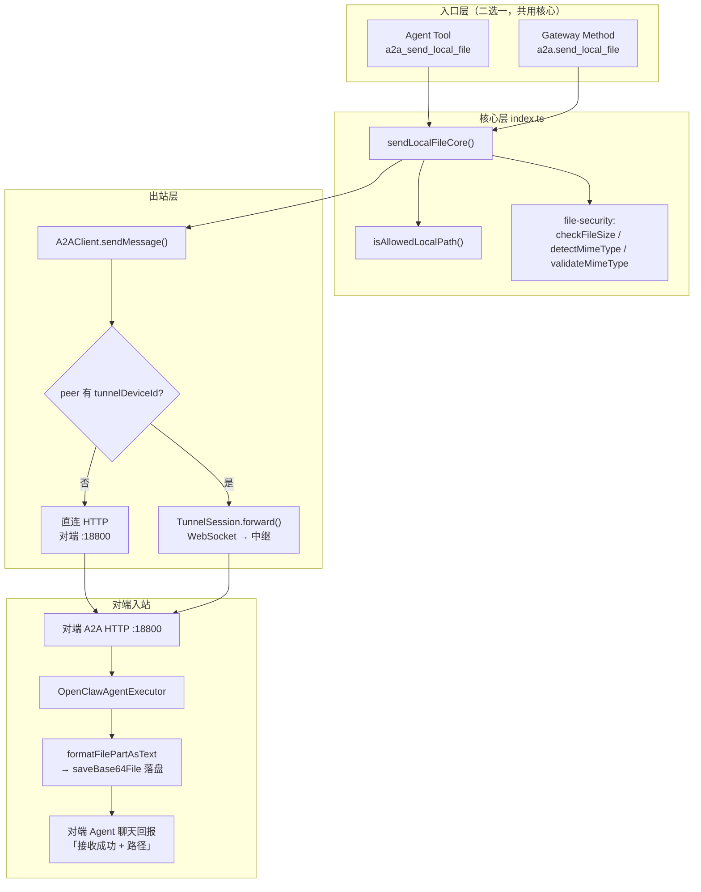
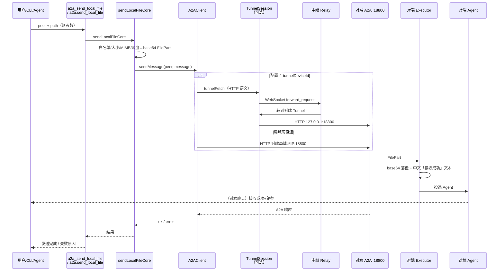

# a2a_send_local_file 实现全流程说明

> **文档位置**：`docs/工作文档/2026-07-30-规范说明-a2a_send_local_file全流程.md`  
> **适用版本**：`1.4.2-tunnel.1` 起落地；接收落盘/原文件名见 **`1.4.3-tunnel.3`**（2026-07-31）  
> **整理日期**：2026-07-30（接收目录与文件名补充见 07-31；传输名/路径回报见 08-03）  
> **目的**：单独说明「本地路径发文件」能力：改了哪些文件、核心代码做什么、端到端怎么走、框架如何分层  
> **接收落盘更新**：[`2026-07-31-改动说明-接收落盘与原文件名.md`](./2026-07-31-改动说明-接收落盘与原文件名.md)  
> **传输名/路径回报**：[`2026-08-03-改动说明-传输文件名与路径回报.md`](./2026-08-03-改动说明-传输文件名与路径回报.md)

---

## 1. 这个能力是什么？

OpenClaw / A2A 里本来就有发文件的能力，但旧路径主要是：

| 方式 | 入口 | 问题 |
|------|------|------|
| `a2a_send_file` | Agent 工具，参数是 **公网 URI** | 本机相册/桌面文件没有公网 URL |
| `a2a.send` + 自己拼 FilePart | CLI / 手工塞 base64 | 大文件 base64 塞进命令行会撞 **ARG_MAX / E2BIG**（约百 KB 级） |
| SoftBus 等其它通道 | 设备侧其它插件 | 和 A2A peer 不是一回事，Agent 容易误用 |

因此新增一对入口，**语义相同、共用同一核心函数**：

| 名称 | 类型 | 谁调用 |
|------|------|--------|
| **`a2a_send_local_file`** | Agent **Tool** | 聊天里的 Agent（读 TOOLS.md 后选工具） |
| **`a2a.send_local_file`** | Gateway **RPC 方法** | CLI：`openclaw gateway call a2a.send_local_file ...` |

共同点：只传短参数 `peer` + 本机绝对路径 `path`，**在插件进程内读盘 → base64 → A2A FilePart → `client.sendMessage`**。

---

## 2. 总体框架（先看图）

### 2.1 分层框架



### 2.2 一句话框架

```text
入口(Tool/RPC)
  → sendLocalFileCore（校验路径/大小/MIME，读文件转 base64 FilePart）
  → A2AClient.sendMessage（A2A JSON-RPC/REST）
  → [可选] Tunnel 把 HTTP 请求封进 WebSocket 经中继
  → 对端 A2A :18800
  → Executor 把 FilePart 解码落盘，变成给 Agent 的中文「接收成功」文本
```

---

## 3. 修改了哪些文件？改了什么？

下列以「落地 `a2a_send_local_file` / 本地路径发文件」相关为准（2026-07-28～29 主改动；接收话术与 MIME 等在 executor / file-security）。

### 3.1 源码（必改）

| 文件 | 角色 | 具体改了什么 |
|------|------|----------------|
| **`index.ts`** | 主战场 | ① `isAllowedLocalPath` 路径白名单 ② **`sendLocalFileCore`** ③ 注册 **`a2a.send_local_file`** ④ 注册工具 **`a2a_send_local_file`**（成功/失败中文文案）⑤ `maxInlineFileSizeBytes` 默认 **50MB** ⑥ JSON body limit 随 inline 上限放大 |
| **`src/file-security.ts`** | MIME | 扩展名映射增补如 `.md`→`text/markdown`、`.heic`→`image/heic`；`detectMimeType` / `checkFileSize` / `validateMimeType` 被 core 复用 |
| **`src/executor.ts`** | 对端接收 | `formatFilePartAsText` + `saveBase64File`：按 **原文件名** 落到 `fileStorage.tempDir`（重名加 ` (n)`）；话术含完整保存路径；MIME 别名 / 魔数嗅探减少误标 `.bin`（`1.4.3-tunnel.3`） |
| **`src/client.ts`** | 出站（既有） | **未为 local_file 单独新写协议**；仍走 `sendMessage`；有 `tunnelDeviceId` 时用 `createTunnelFetch` |
| **`src/tunnel/*`** | 中继（既有） | 不感知「是不是本地文件」；只转发已是 HTTP 形态的 A2A 请求 |
| **`openclaw.plugin.json`** | Schema | `security.maxInlineFileSizeBytes` / `maxFileSizeBytes` 默认 `52428800`；另有 `fileStorage.tempDir`（接收目录） |
| **`package.json`** | 版本 | 随发版递增（如 `1.4.2-tunnel.1`） |
| **`skill/scripts/a2a-send.mjs`** | Skill 脚本 | `--file-path` 与 50MB 上限对齐 |
| **`tests/a2a-gateway.test.ts`** 等 | 测试 | 断言方法已注册；相对路径/白名单外路径拒绝；读盘发送 FilePart |

### 3.2 设备侧非源码（行为约束，强烈相关）

| 文件 | 改了什么 |
|------|----------|
| 设备 `TOOLS.md` / `MEMORY.md` | **强制**聊天发本地文件必须用 `a2a_send_local_file`；禁止 SoftBus / `a2a_send_file` / 贴 base64；约定「发送完成」话术 |
| 设备 `openclaw.json` | `security.maxFileSizeBytes` / `maxInlineFileSizeBytes` → 50MB |
| 手机 bundled 插件路径 | 必须覆盖 `/data/local/npm/lib/node_modules/openclaw/extensions/a2a-gateway/`，否则会出现 `unknown method: a2a.send_local_file` |

### 3.3 `index.ts` 里核心逻辑在做什么（对应代码位置）

**路径白名单 `isAllowedLocalPath`（约 887–921 行）**

- 必须绝对路径、无 `\0`
- 规范化 `\`、去掉 Windows 盘符后再匹配前缀：
  - `/data/local/`
  - `/storage/media/`
  - `/mnt/user/`
  - `/mnt/hmdfs/`
  - `/home/`

**核心 `sendLocalFileCore`（约 923–1013 行）逐步：**

1. `findPeer(peer)` — 找不到则返回可用 peer 列表  
2. `isAllowedLocalPath(path)` — 路径安全  
3. `fs.statSync` — 必须是普通文件  
4. `checkFileSize(size, maxInlineFileSizeBytes)` — 默认上限 50MB  
5. `name` **强制** `path.basename(filePath)`（**忽略** `params.name`）；`mimeType` 默认 `detectMimeType(path)`  
6. `validateMimeType` — 必须在允许列表  
7. `fs.readFileSync` → **base64 字符串**  
8. 组装 A2A parts：可选 text + `{ kind: "file", file: { bytes, name, mimeType } }`  
9. `client.sendMessage(peer, message, { healthManager, retryConfig })`  
10. 返回 `{ ok, path, name, mimeType, sizeBytes, response, ... }` 或错误

**Gateway 方法注册（约 1015–1041 行）**

```text
api.registerGatewayMethod("a2a.send_local_file", …)
```

- 校验 `peer`、`path` 字符串  
- 调用 `sendLocalFileCore`  
- 成功 `respond(true, result)`；失败带 `error.message` 供 CLI 显示  
- **注册在 `if (api.registerTool)` 之外**，保证没有 Tool API 时 RPC 仍可用  

**Agent 工具注册（约 1146–1196 行）**

```text
api.registerTool({ name: "a2a_send_local_file", … })
```

- `execute` 同样调用 `sendLocalFileCore`  
- 成功返回中文工具结果，要求 Agent 对用户说「发送完成」并带 peer、文件名  

---

## 4. 端到端全流程（一步一步）

下面以「PC 聊天让 Agent 把本机文件发给 Phone」且 **走中继** 为例（直连时第 6 步改为 HTTP 直打 Phone `:18800`）。

### 步骤 1 — 用户 / TOOLS 约束

用户说：「把某某图片发给 HW-Phone1」。  
Agent 读 `TOOLS.md`：本地文件 **必须** 调 `a2a_send_local_file`，参数例如：

- `peer`: `HW-Phone1`  
- `path`: `/storage/media/.../Photo/.../IMG.jpg`（绝对路径）  
- **不要传 `name`**（即使传了也会被忽略；传输文件名 = `basename(path)`）

### 步骤 2 — Tool 入口

OpenClaw 调用插件注册的 `a2a_send_local_file.execute`  
→ 进入 `sendLocalFileCore(params)`。

（若用 CLI，则是 `a2a.send_local_file` RPC → 同一个 `sendLocalFileCore`。）

### 步骤 3 — 本机安全与读盘

1. 确认 peer 在配置里  
2. 路径白名单 + 绝对路径  
3. stat / 大小 ≤ `maxInlineFileSizeBytes`  
4. MIME 合法  
5. 整文件读入内存并 base64（注意：大文件内存与中继承载仍是瓶颈）

### 步骤 4 — 变成 A2A 消息

构造：

```json
{
  "parts": [
    { "kind": "file", "file": { "bytes": "<base64>", "name": "IMG.jpg", "mimeType": "image/jpeg" } }
  ]
}
```

可选再带 `text`、`agentId`。

### 步骤 5 — 出站 `A2AClient.sendMessage`

- 按 peer 的 `agentCardUrl` 解析出 A2A path（如 `/a2a/jsonrpc`）  
- 若 peer 配置了 **`tunnelDeviceId`** 且本机 tunnel 已启用：  
  - `createFetch` 换成 `createTunnelFetch(tunnel, "HW-Phone1")`  
  - **不会**按 URL host 去连对端；host 可写 `127.0.0.1` 仅占位  

### 步骤 6 — 隧道（跨网时）

1. Tunnel 把这次「HTTP 请求」（JSON-RPC body 里已含巨大 base64）打成 `forward_request`  
2. WebSocket 发到 `relayUrl`（如 `ws://121.37.53.35:8001`）  
3. 中继按 `target_device=HW-Phone1` 转给手机上的 Tunnel  
4. 手机 Tunnel **对本机** `http://127.0.0.1:18800` + 原 path 发真正 HTTP（代码写死回环 + `localServicePort`）

### 步骤 7 — 对端 A2A 入站

Phone 的 Express A2A 收到 JSON-RPC → `DefaultRequestHandler` → `OpenClawAgentExecutor`。

Executor 扫描 message parts：遇到 `kind: "file"` 且有 `bytes`：

1. `saveBase64File` 解码写到 `fileStorage.tempDir`（现网：PC=`.../Download/OPENCLAW`，Phone=`.../Docs/OPENCLAW`；未配置则 `tmpdir/a2a-files`），**文件名 = FilePart.name**（发送侧已强制为 basename）  
2. `formatFilePartAsText` 生成中文说明，含 **保存路径**，并要求原样回报、禁止改写成旧 `a2a-files`  
3. 因为 Gateway 的 agent RPC 主要吃字符串，FilePart 被「翻译」成文本后再交给本地 Agent  

（落盘目录见 [`2026-07-31-改动说明-接收落盘与原文件名.md`](./2026-07-31-改动说明-接收落盘与原文件名.md)；传输名与聊天路径见 [`2026-08-03-改动说明-传输文件名与路径回报.md`](./2026-08-03-改动说明-传输文件名与路径回报.md)。）

### 步骤 8 — 对端 Agent 回报

TOOLS / MEMORY 要求：看到「A2A 文件接收成功」时，聊天里明确说「接收成功」，并**原样完整复制**消息里的「保存路径」绝对路径；禁止改写成 `/data/local/tmp/a2a-files/`。

### 步骤 9 — 响应原路返回

Phone A2A HTTP 响应 →（隧道则再封 `forward_response`）→ PC `sendMessage` 返回 ok  
→ Tool 给本机 Agent 中文「【A2A 发送完成】…」  
→ 本机 Agent 对用户说「发送完成」。

---

## 5. 时序图（直传 + 中继）



---

## 6. 与 `a2a_send_file` 的对比

| | `a2a_send_local_file` | `a2a_send_file` |
|--|----------------------|-----------------|
| 参数 | `path`（本机绝对路径） | `uri`（公网 URL） |
| 读盘 | 本插件进程内 `readFileSync` | 不读本机盘；对端按 URI 引用 |
| FilePart | `{ bytes, name, mimeType }` | `{ uri, name?, mimeType? }` |
| 适用 | 相册、桌面、workspace 样例 | 已托管在公网的文件 |
| CLI | `a2a.send_local_file` | 可用 `a2a.send` 自拼，或工具侧 URI |

---

## 7. 调用示例

### 7.1 CLI（Gateway 方法）

```bash
openclaw gateway call a2a.send_local_file --timeout 300000 \
  --params '{"peer":"HW-Phone1","path":"/data/local/.openclaw/workspace/a2a-fixtures/L-1mb.mp4"}'
```

### 7.2 Agent 工具

```text
工具名: a2a_send_local_file
参数:
  peer: HW-Phone1
  path: /storage/media/100/local/files/Photo/.../IMG.jpg
```

### 7.3 相关配置（`openclaw.json` 摘录）

```json
"security": {
  "maxFileSizeBytes": 52428800,
  "maxInlineFileSizeBytes": 52428800
},
"peers": [{
  "name": "HW-Phone1",
  "tunnelDeviceId": "HW-Phone1",
  "agentCardUrl": "http://127.0.0.1:18800/.well-known/agent-card.json"
}]
```

跨网时：真正找人对端靠 `tunnelDeviceId`；`agentCardUrl` 的 host 可写回环占位。

---

## 8. 部署注意（否则会出现 unknown method）

1. 改的是插件源码，必须同步到设备加载路径并 **重启 gateway**。  
2. **手机**优先加载 bundled：  
   `/data/local/npm/lib/node_modules/openclaw/extensions/a2a-gateway/`  
   只改 `extensions/` 或 `tools/` 不够。  
3. PC 常见加载：`workspace/plugins/a2a-gateway` 与 `extensions/a2a-gateway`（注意 duplicate 警告，实际生效以启动日志为准）。  
4. TOOLS.md 不更新时，Agent 仍可能误用 SoftBus / `a2a_send_file`。

---

## 9. 限制与已知边界

| 点 | 说明 |
|----|------|
| 整文件进内存 + base64 | 体积约 ×4/3；50MB 配置 ≠ 中继一定能稳传 |
| 公网中继实测 | 大文件（约 15MB+ / 40MB）易超时或隧道断开；可靠区常 ≤10～30MB 视网络而定 |
| 路径白名单 | 白名单外路径直接拒绝 |
| 传输形态 | 仍是 inline FilePart，不是分片/对象存储 |

---

## 10. 相关文档

| 文档 | 关系 |
|------|------|
| [2026-07-29-改动说明-本地文件50M总览.md](./2026-07-29-改动说明-本地文件50M总览.md) | 同期总改动（含 TOOLS、设备配置） |
| [2026-07-28-改动说明-本地文件50M初版.md](./2026-07-28-改动说明-本地文件50M初版.md) | 初版改动清单 |
| [2026-07-28-变更记录-A2A本地文件50M.md](./2026-07-28-变更记录-A2A本地文件50M.md) | 设备部署与 SoftBus 排查 |
| [2026-07-29-规范说明-TOOLS与Harness.md](./2026-07-29-规范说明-TOOLS与Harness.md) | 为何要在 TOOLS 强制该工具 |

---

*本文只讲清 `a2a_send_local_file` / `a2a.send_local_file` 的实现与全流程；隧道假死重连见同目录隧道重连改动说明。*
